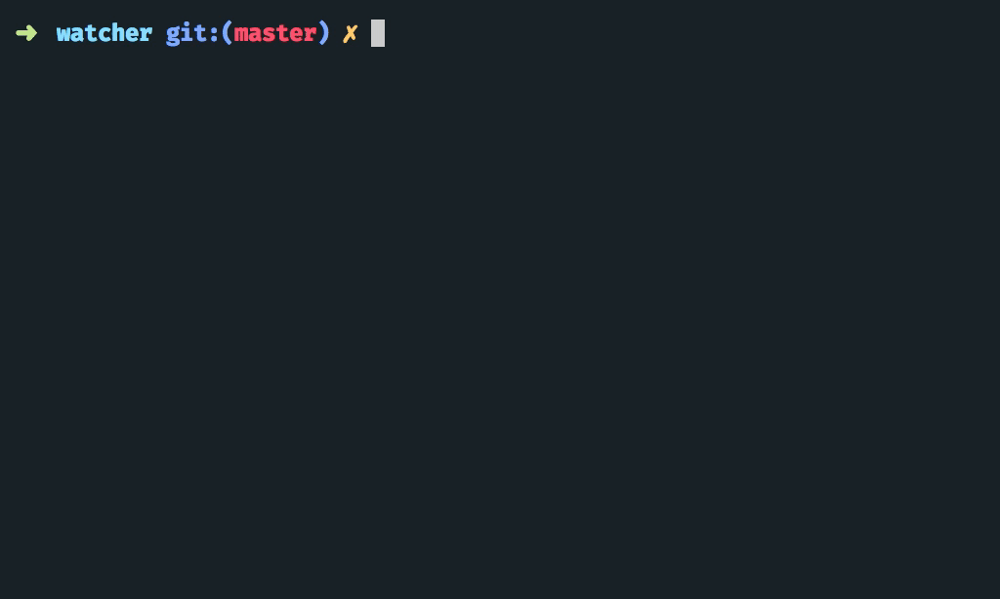

# Dewatch

Watch & compile typescript file using deno with bash script — Learn Deno



> Currently tested only on OSX 10.12.6

### Prepare

For OSX first you must install **md5sha1sum** using **[brew](https://brew.sh/)**, if you already have **brew** on your local machine. Just run a single command below :

```
$ brew install md5sha1sum
```

### Usage

1. Download bash script file

```
git clone https://github.com/muhibbudins/deno-watcher.git && mv deno-watcher/watcher /usr/local/bin/dewatch && chmod +x /usr/local/bin/dewatch && rm -rf deno-watcher
```

2. Run **dewatch** using this command :

```
$ dewatch <your file>
```

### Related

- [Argument Parser](https://github.com/muhibbudins/deno-arguments)
- [Read File](https://github.com/muhibbudins/deno-readfile)
- [Yaml Parser](https://github.com/muhibbudins/deno-yaml)
- [All Topic](https://github.com/topics/learn-deno)

### License

This project under MIT License
